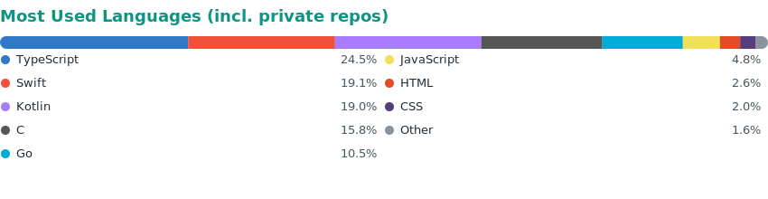
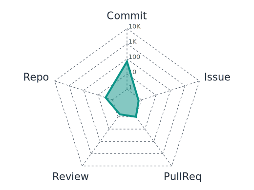

<!-- ╔══════════════════════════════════════════════════════════════╗ -->
<!-- ║  grpcer · GitHub Profile README                                ║ -->
<!-- ║  Transparent cards + prefers-color-scheme adaptive.            ║ -->
<!-- ║  Every image is served by a verified-up service (no GRS).      ║ -->
<!-- ║  3D contrib calendar is self-hosted via profile-3d.yml cron.   ║ -->
<!-- ╚══════════════════════════════════════════════════════════════╝ -->

```
 __ _ _ __ _ __   ___ ___ _ __
/ _` | '__| '_ \ / __/ _ \ '__|
| (_| | |  | |_) | (_|  __/ |
 \__, |_|  | .__/ \___\___|_|
 |___/     |_|
```

<div align="center">

<!-- ===== Typing banner (teal reads well on both backgrounds) ===== -->
<a href="https://github.com/grpcer">
  
</a>

<!-- ===== Status badges ===== -->
<p>
  
  <a href="https://github.com/grpcer?tab=followers"></a>
  <a href="https://github.com/grpcer/tokpet"></a>
</p>

</div>

---

### 👋 About me

```ts
const grpcer = {
  role:   "Indie full-stack developer",
  focus:  "BYOK multi-model AI clients · desktop pets · ship ideas to every platform",
  stack:  ["SwiftUI", "Jetpack Compose", "Next.js", "Go"],
  motto:  "Ship small, ship often. 100% commits, no excuses.",
}
```

- 🧩 **Building** — `oriveo` (BYOK multi-model AI client across iOS / Android / Web / Go) & `tokpet` (desktop pet · AI usage companion)
- 🛰️ **Into** — cross-platform architecture, streaming UI, local-first data sync
- 🐾 **Style** — a one-person team, from the client all the way down to the DB migrations

---

### 🛠 Tech Stack

<div align="center">

<!-- Icon wall: colorful skillicons.dev, dark variant for dark theme, light for light theme -->
<!-- NOTE: commas in the `i` list MUST be %2C-encoded inside srcset — srcset's own
     comma-separated candidate syntax otherwise truncates the URL at the first comma
     (this is what caused icons to "disappear" in dark mode before). -->
<!-- NOTE: no dedicated Jetpack Compose icon upstream — covered in the text line below instead -->
<picture>
  <source media="(prefers-color-scheme: dark)" srcset="https://skillicons.dev/icons?i=swift%2Ckotlin%2Cts%2Cnext%2Creact%2Ctailwind%2Cgo%2Cc%2Cruby%2Cpostgres%2Credis%2Cdocker&theme=dark&perline=12" />
  
</picture>

</div>

> **Mobile** — iOS: SwiftUI · GRDB ｜ Android: Jetpack Compose · Koin
> **Web** — Next.js · React · Zustand · Tailwind
> **Backend & Infra** — Go (Gin) · PostgreSQL · Redis · Docker

---

### 🌐 Languages

<!-- 聚合全部仓库(含 private)语言字节数，每日自动重画，见 lang-stats.yml + scripts/gen_lang_stats.py -->
<div align="center">

<picture>
  <source media="(prefers-color-scheme: dark)" srcset="./lang-stats/lang-stats-dark.svg" />
  
</picture>

</div>

---

### 📊 Activity

<div align="center">

<!-- Streak (streak-stats.demolab.com — verified up) -->
<picture>
  <source media="(prefers-color-scheme: dark)" srcset="https://streak-stats.demolab.com?user=grpcer&hide_border=true&background=00000000&ring=2DD4BF&fire=2DD4BF&currStreakLabel=2DD4BF&sideLabels=9BA1A6&currStreakNum=C9D1D9&sideNums=C9D1D9&dates=8B949E&stroke=2DD4BF" />
  
</picture>

<!-- Contribution trend (github-readme-activity-graph — verified up) -->
<picture>
  <source media="(prefers-color-scheme: dark)" srcset="https://github-readme-activity-graph.vercel.app/graph?username=grpcer&hide_border=true&bg_color=00000000&color=2DD4BF&line=2DD4BF&point=FFFFFF&area=true&area_color=2DD4BF&title_color=2DD4BF&text_color=9BA1A6" />
  
</picture>

<!-- Snake (dark + light variants, raw.githubusercontent — verified up) -->
<picture>
  <source media="(prefers-color-scheme: dark)" srcset="https://raw.githubusercontent.com/grpcer/grpcer/output/snake-dark.svg" />
  
</picture>

<!-- Contribution radar (yoshi389111/github-profile-3d-contrib, radar_contrib_only — self-hosted, daily cron via profile-3d.yml) -->
<picture>
  <source media="(prefers-color-scheme: dark)" srcset="./profile-3d-contrib/radar-dark.svg" />
  
</picture>

</div>

---

### 🚀 Featured Projects

**🐾 [tokpet](https://github.com/grpcer/tokpet)** — desktop pet · AI usage companion
[](https://github.com/grpcer/tokpet/stargazers)
[](https://github.com/grpcer/tokpet)
[](https://github.com/grpcer/tokpet/commits)

**🍺 [homebrew-tokpet](https://github.com/grpcer/homebrew-tokpet)** — Homebrew tap for tokpet
[](https://github.com/grpcer/homebrew-tokpet/stargazers)
[](https://github.com/grpcer/homebrew-tokpet)
[](https://github.com/grpcer/homebrew-tokpet/commits)

> 🛠️ **oriveo** — a BYOK multi-model AI client (14 providers + custom Relay endpoints + a free tier), shipping across iOS / Android / Web / Go. Currently in private development.

---

### 🔗 Connect

<div align="center">

<a href="mailto:ifconfigure@gmail.com"></a>
<a href="https://github.com/grpcer"></a>

</div>

<div align="center"><sub>🐾 Built one commit at a time.</sub></div>
