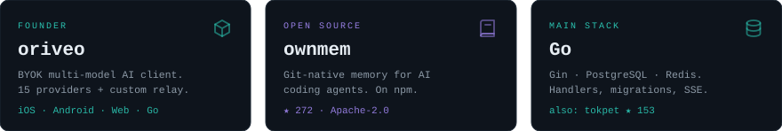

<!-- ╔══════════════════════════════════════════════════════════════╗ -->
<!-- ║  grpcer · GitHub Profile README                                ║ -->
<!-- ║  Every visual is a self-hosted SVG under assets/ — no badge    ║ -->
<!-- ║  service decides how this page looks.                          ║ -->
<!-- ║  hero.svg is hand-written and static; roles/stats/activity     ║ -->
<!-- ║  are redrawn daily by profile-stats.yml.                       ║ -->
<!-- ║  Dark cards on purpose: they read the same in both themes.     ║ -->
<!-- ╚══════════════════════════════════════════════════════════════╝ -->

  

 

  

  <a href="https://github.com/grpcer/ownmem"><b>ownmem</b></a> ·
  <a href="https://www.npmjs.com/package/ownmem">npm</a> ·
  <a href="https://github.com/grpcer/tokpet"><b>tokpet</b></a> ·
  <a href="mailto:ifconfigure@gmail.com">say hi</a>

I build the whole thing myself — the Go handler, the migration that backs it,
and the SwiftUI view that calls it. Currently deep in **oriveo**: a BYOK
multi-model AI client with 15 providers and custom relay endpoints, shipping to
iOS, Android, Web and a Go backend.

---

### 📊 Stats

  

  

<!-- Snake (dark + light variants, generated by snake.yml into the output branch) -->
<picture>
  <source media="(prefers-color-scheme: dark)" srcset="https://raw.githubusercontent.com/grpcer/grpcer/output/snake-dark.svg" />
  
</picture>

---

### 🚀 Projects

**🧠 [ownmem](https://github.com/grpcer/ownmem)** — Git-native memory for AI coding agents
Deterministic local recall for Claude Code, Codex, Cursor and Gemini CLI. Apache-2.0, on npm.

**🐾 [tokpet](https://github.com/grpcer/tokpet)** — desktop pet · AI usage companion
Lives in the menu bar and reacts to what your AI tokens are costing you.

**🛠️ oriveo** — BYOK multi-model AI client · *private*
15 providers + custom relay endpoints + a free tier. Go backend, shipping to iOS / Android / Web.

---

### 🔗 Connect

  

🐾 Built one commit at a time.

