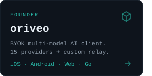
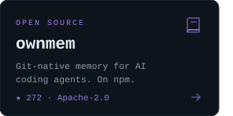
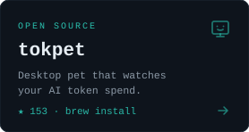
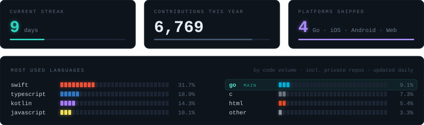
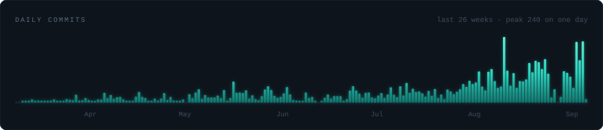

<!-- ╔══════════════════════════════════════════════════════════════╗ -->
<!-- ║  grpcer · GitHub Profile README                                ║ -->
<!-- ║  Every visual is a self-hosted SVG under assets/ — no badge    ║ -->
<!-- ║  service decides how this page looks.                          ║ -->
<!-- ║  hero.svg is hand-written and static; card-*/stats/activity    ║ -->
<!-- ║  are redrawn daily by profile-stats.yml.                       ║ -->
<!-- ║  Dark cards on purpose: they read the same in both themes.     ║ -->
<!-- ╚══════════════════════════════════════════════════════════════╝ -->

  

 

<!-- 三张卡必须写在同一行、彼此之间不留任何空白：换行或空格会被渲染成一个空格
     字符，把卡片挤开导致换行。宽度用百分比而不是像素——README 容器宽度随窗口和
     页面（个人主页 / 仓库页）变化，写死像素就是在猜它有多宽，猜大了第三张会掉行。
     三张按 296:296:278 分配，合计 99.7%，留 0.3% 余量。卡间距画在 SVG 里。 -->

  

  

---

<!-- 这一段连续写、不留空行：
 里的空行会被当成段落分隔，
     加上    就会在页脚撑出一大片空白。换行用   显式控制。
     badge 一律写成单段（badge/<文字>-<色>），两段式的 label 会渲染成灰底色块，
     和整页的深色卡片不搭。 -->

 

 
🐾 Built one commit at a time.

